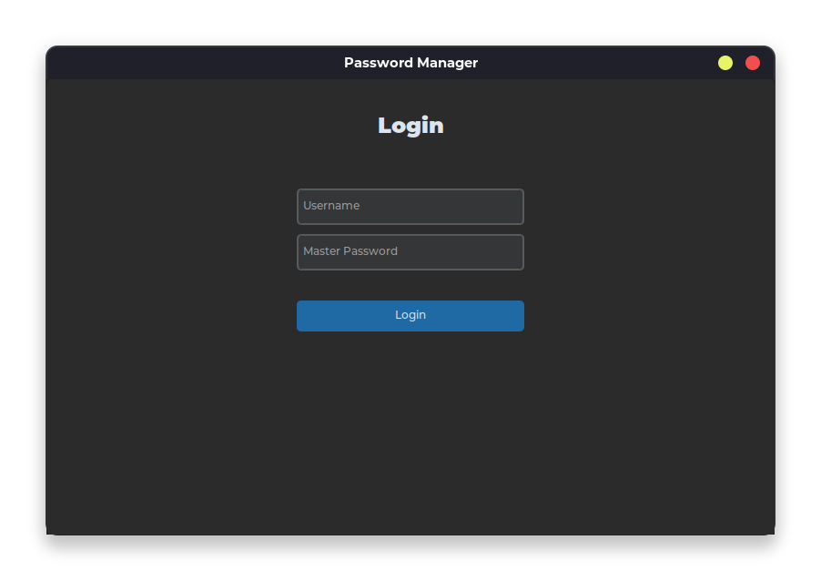

# Spord: A Simple Password Manager App

Spord is an open-source password manager application built with Python and the custom Tkinter module. It provides a simple and user-friendly interface for securely storing and retrieving passwords for various websites.

## Screenshots

<div  align="center">
<div>




</div>
</div>

## Overview

Spord allows users to register and log in with a unique username and password. Once logged in, users can add new passwords, view saved website names, and retrieve passwords for specific websites. The app supports multiple frames for an enhanced user experience. On subsequent launches, Spord will automatically detect the encrypted master password file and display the login screen. If the file is not found, the registration screen will be shown.

## Features

- User registration and login
- Add and store passwords for websites
- Retrieve passwords by entering the corresponding website name
- View a list of saved website names
- Logout functionality
- Encryption and decryption of passwords using the cryptography module
- Modern and intuitive graphical user interface (GUI) built with custom Tkinter

## Dependencies

Spord relies on the following Python modules:

- `cryptography`: Used for encrypting and decrypting passwords
- `customtkinter`: Provides a custom Tkinter GUI toolkit
- `CTkMessagebox`: A modern message box alternative for custom Tkinter

You can install them using:

```bash
pip install customtkinter CTkMessagebox cryptography
```

## Installation and Setup

1. Clone the Spord repository from GitHub:

   ```
   git clone https://github.com/your-username/spord.git
   ```

2. Navigate to the project directory:

   ```
   cd spord
   ```

3. Run the application using Python:

   ```
   python main.py
   ```

No additional installation or setup is required. Spord is designed to run on any system with Python installed.

## Project Structure

The project consists of a single `main.py` file containing the entire codebase. The `CTkMessagebox` module uses some PNG files present in the project folder. The key modules utilized are:

- `cryptography`: Used for password encryption and decryption
- `customtkinter`: Provides the GUI components
- `CTkMessagebox`: A modern message box alternative
- `hashlib`: Used for encoding the master password during registration and login

## Code Overview

The `App` class is the main component of the project, containing various functions for different functionalities:

- `generate_key()`: Generates a key using the cryptography module for encryption and decryption.
- `register()`: Handles user registration.
- `login()`: Handles user login.
- `add_password()`: Allows users to add new passwords.
- `get_password()`: Retrieves passwords for a given website.
- `view_websites()`: Displays a list of saved website names.
- `logout()`: Logs out the user and returns to the login screen.
- `show_frame()`: Controls which frame (registration, login, or main app) is displayed.

## Usage

1. Launch the application by running `python main.py`.
2. If you're a new user, register by providing a username and password.
3. For subsequent launches, log in with your registered credentials.
4. In the main app window, you can:
   - Add new passwords by entering the website name and password.
   - Retrieve a password by entering the website name and clicking the "Get Password" button.
   - View a list of saved website names without entering any information.
5. Use the logout functionality to return to the login screen.

## Limitations and Improvements

While Spord is a functional password manager, it has some limitations:

- Two-factor authentication (2FA) is not implemented.
- The app is intended for educational purposes and should not be used as a daily password manager due to its open-source nature.

Potential areas for improvement include:

- Adding 2FA support for enhanced security
- Implementing additional features like password generation, password strength indicators, and more

## Contributing

Contributions to Spord are welcome! If you'd like to contribute, please follow these guidelines:

1. Fork the repository and create a new branch for your changes.
2. Make your modifications and ensure they adhere to the project's coding standards.
3. Test your changes thoroughly.
4. Submit a pull request with a detailed description of your changes.

Please note that pull requests should be made to a separate branch, not directly to the main branch.

## License

Spord is released under the [MIT License](https://opensource.org/licenses/MIT). You are free to use, modify, and distribute the code as per the terms of the license.
